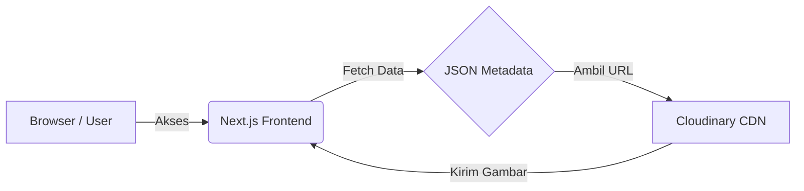
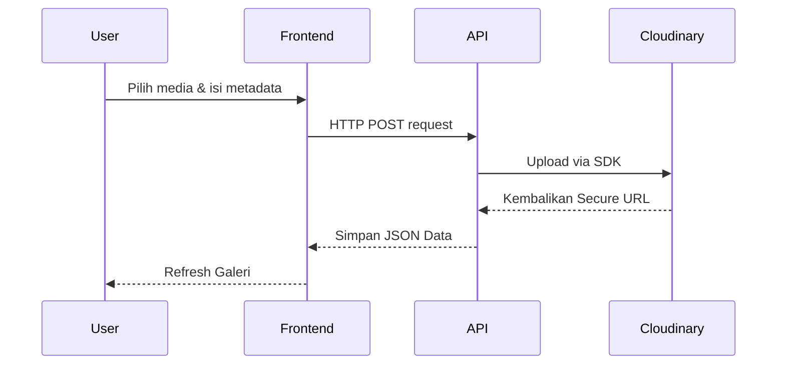

<div align="center">
  <h1>🌟 Tadika</h1>
  <p><em>Website eksklusif untuk menyimpan dan mengorganisir ribuan kenangan, foto, video, serta cerita perjalanan sirkel.</em></p>

  
  
  
  
  
</div>

<hr />

## 📖 Project Overview

**Tadika** adalah sebuah platform arsip digital internal yang dirancang khusus untuk anggota sirkel (±20 orang). Tujuannya adalah untuk menjadi wadah utama dalam menyimpan kenangan berbentuk media (foto, video), cerita *trip*, dan arsip *hangout* secara rapi, cepat, dan terpusat. 

Mampu menampung hingga **10.000+ foto dan video** tanpa mengorbankan performa, Tadika adalah perpaduan elegan antara galeri *masonry* sekelas Pinterest dan platform dokumentasi personal.

### ✨ Fitur Utama
- 📸 **Galeri Terstruktur** - Koleksi foto dan video berdasarkan kategori (Pantai, Gunung, Kota, Random, Throwback).
- ⚡ **Performa Kilat** - Menggunakan *Lazy Loading*, *Pagination*, dan CDN Cloudinary untuk akses gambar instan.
- 📤 **Upload Mandiri** - Anggota dapat langsung mengunggah dokumentasi melalui web (Upload Form).
- 🧩 **Tampilan Pintar (Masonry)** - *Layout* galeri rapi yang mengoptimalkan tampilan potret maupun lanskap.
- ✨ **Animasi Mulus** - *Scroll reveal* dan transisi page premium menggunakan Framer Motion.
- 🔒 **Akses Terbatas** - Sistem tertutup (Internal) menjaga privasi data.

---

## 🛠️ Tech Stack & Ekosistem

Tadika dibangun di atas ekosistem modern yang menawarkan pengalaman *zero-cost* (free-tier) di ranah *production* dengan kapabilitas maksimal.

| Layer | Technology | Kegunaan |
|-------|------------|-----------|
| **Frontend** | [Next.js](https://nextjs.org/) | Framework utama, optimasi SEO & API Routes |
| **Styling** | [Tailwind CSS](https://tailwindcss.com/) | Desain *utility-first* yang cepat dan dinamis |
| **Animation** | [Framer Motion](https://www.framer.com/motion/) | Transisi halaman dan mikro-animasi UI |
| **Gallery** | `react-photo-album` | Membuat tampilan *Masonry* layaknya Pinterest |
| **Media Host** | [Cloudinary](https://cloudinary.com/) | Storage media (Foto/Video) & distribusi CDN |
| **Deployment** | [Vercel](https://vercel.com/) | Hosting performa tinggi (*Serverless*) |

---

## 📂 Struktur & Arsitektur

### Alur Sistem Utama Website



### Flow Upload Media



### Struktur Direktori Repositori

```text
/
├── src/
│   ├── app/           # App router Next.js (Home, Gallery, Ensiklopedia, etc)
│   ├── components/    # Komponen React reusable (Navbar, GalleryGrid, Modal)
│   ├── context/       # State management global (Theme)
│   ├── data/          # Database flat-file & JSON metadata
│   ├── lib/           # Utility dan koneksi library (Cloudinary configs)
│   └── styles/        # File global/local CSS
├── public/            # Static assets (fonts, default images)
└── package.json       # Dependencies dan script npm
```

---

## 📊 Kapasitas Target (Estimasi Sistem)

| Komponen | Kapasitas |
|:---|:---|
| **Koleksi Foto** | ~5.000 hingga 10.000 item |
| **Koleksi Video** | ~100+ item eksklusif |
| **Jumlah User Maksimal** | ~20 Pengguna Aktif (Sirkel) |
| **Kategori Aktif** | ±10 Kategori spesifik |
| **Load per Halaman** | 20 - 40 Media (Efisiensi Pagination) |

---

## 🚀 Opsional & Pengembangan Mendatang (Roadmap)

- [ ] **Random Memory Generator**: Fitur menampilkan foto secara acak sesuai arsip lama.
- [ ] **Trip Timeline**: Linimasa interaktif mengenai sejarah terbentuknya dan perjalanan sirkel.
- [ ] **Interactive Maps**: Peta interaktif dari tempat-tempat atau villa yang pernah dikunjungi.
- [ ] **Memory Counter**: Kalkulator hari/waktu semenjak trip atau hangout terakhir dilakukan.

---
<p align="center">
  Dibuat dengan ❤️ oleh Tadika Team
</p>
